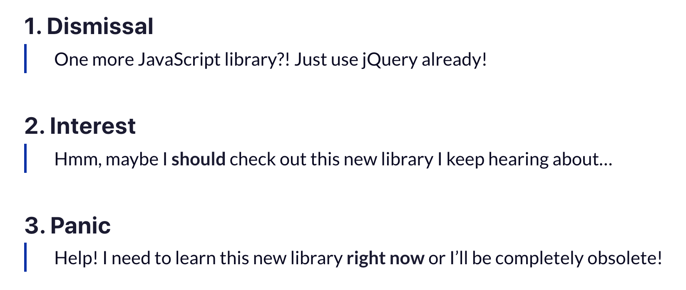

## Learning Graphql

### John Fay

#### Follow along?

###### 1. Have docker :|

###### 2. `git clone git@github.com:keonik/react-ui-bb.git`

###### 3. `cd learn-graphql`

###### 4. `npm install`

###### 5. `docker-compose up`

---

## Agenda

-   What is graphql?
-   (Pros) What does it solve?
-   (Cons) What issues does it cause?
-   How will it help Mile Two
-   How it will help your professional development
-   Example
    -   Tools
        -   What
        -   Why

---

## About me

-   6 months of GraphQL exposure
    -   1 month head down learning



---

### What is Graphql?

A query language for your API

[View the docs for yourself](https://graphql.org/)

---


## Problem

-   /posts
-   You want to fetch posts but want likes with username and avatars
-   tweak posts to include likes containing user objects
-   But wait... here comes mobile
    -   extra data
    -   slowing things down
-   two endpoints
    -   with likes
    -   without likes
-   posts in database but likes in redis cache
-   Good REST API's starting to show their limits

---

# What does it solve?

-   Instead of having multiple "dumb" endpoints have one "smart" one that can take complex queries and turn it into what the client needs
-   Having an assistant for your data
    -   groceries
    -   pizza
    -   dry cleaning

# What issues does it cause?

-   Superfluous Database Calls (N+1 problem)
    -   Solution: dataloader batching/caching
-   All this relation ability causes performance issues
    -   query caching
-   Everything is a POST...
    -   welp...

---

# What are the people saying?

## [State of js 2019](https://2019.stateofjs.com/data-layer/graphql/)

---

### Now lets show that awesome frontend DX(Developer Experience)

## 

---

### Things you'll need

-   `npx create-react-app gql-demo`
-   `npm install apollo-boost graphql @apollo/react-hooks`

##### apollo-boost

Zero config apollo client

#### @apollo/react-hooks

Hooks for your queries/mutations

#### graphql

Write queries like so: gql``

---

# Now onto the API work

---

### Things you'll need

`npm install apollo-server pg reflect-metadata typeorm type-graphql`

##### apollo-server

-Server...

##### pg

Database - postgresql

##### reflect-metadata

Makes the decorator @ recognized for classes

##### typeorm

Object relational mapping for NodeJS with latest javascript features

##### type-graphql

Makes it so you can do graphql stuff but typed

---

### Create a model

```js
export class User {
    id
    firstName
    lastName
}

export class UserTyped {
    id: number
    firstName: string
    lastName: string
}
```

You'll use these across projects so typing has it's benefits

---

### Create entity

```js
import { Entity } from 'typeorm'

@Entity()
export class User {
    id: number
    firstName: string
    lastName: string
}
```

Tells server that this links to our orm

---

### Add table columns

```js
import { Entity, Column, PrimaryGeneratedColumn } from 'typeorm'

@Entity()
export class User {
    @PrimaryGeneratedColumn()
    id: number

    @Column()
    firstName: string

    @Column()
    lastName: string
}
```

Project is aware of database column

---

### Add type-graphql decorators

```js
...
import {ObjectType, ID, Field} from 'type-graphql';

@ObjectType()
@Entity()
export class User {
    @Field(() => ID)
    @PrimaryGeneratedColumn()
    id: number

    @Field(() => String)
    @Column()
    firstName: string

    @Field(() => String)
    @Column()
    lastName: string
}
```

Lets graphql query the User object and their fields

---
